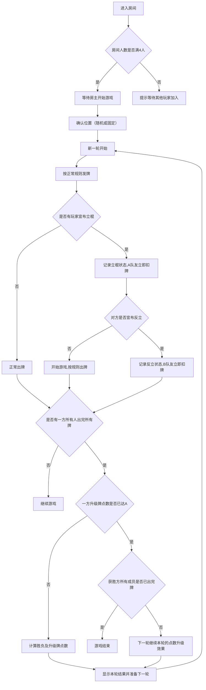

```mermaid
graph TD
    A[进入房间] --> B{房间人数是否满4人}
    B -- 是 --> C[等待房主开始游戏]
    B -- 否 --> D[提示等待其他玩家加入]
    C --> E[确认位置（随机或固定）]
    E --> N[新一轮开始]
    N --> F[按正常规则发牌]
    F --> G{是否有玩家宣布立棍}
    G -- 否 --> H[正常出牌]
    G -- 是 --> I[记录立棍状态,A队友立即扣牌]
    I --> J{对方是否宣布反立}
    J -- 否 --> K[开始游戏,按规则出牌]
    J -- 是 --> L[记录反立状态,B队友立即扣牌]
    H --> M{是否有一方所有人出完所有牌}
    M -- 否 --> O[继续游戏]
    M -- 是 --> P{一方升级牌点数是否已达A}
    P -- 否 --> Q[计算胜负及升级牌点数]
    P -- 是 --> R{获胜方所有成员是否已出完牌}
    R -- 是 --> END[游戏结束]
    R -- 否 --> T[下一轮继续本轮的点数升级效果]
    Q --> U[显示本轮结果并准备下一轮]
    T --> U
    U --> N
    K --> M
    L --> M
```