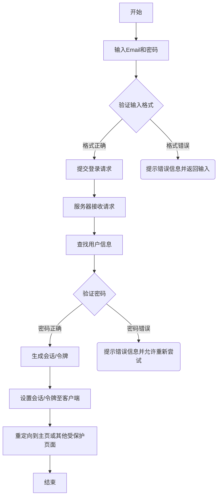

```mermaid
graph TD
    A[开始] --> B[输入Email和密码]
    B --> C{验证输入格式}
    C -- 格式正确 --> D[提交登录请求]
    C -- 格式错误 --> B2(提示错误信息并返回输入)
    D --> E[服务器接收请求]
    E --> F[查找用户信息]
    F --> G{验证密码}
    G -- 密码正确 --> H[生成会话/令牌]
    G -- 密码错误 --> I(提示错误信息并允许重新尝试)
    H --> J[设置会话/令牌至客户端]
    J --> K[重定向到主页或其他受保护页面]
    K --> L[结束]
```