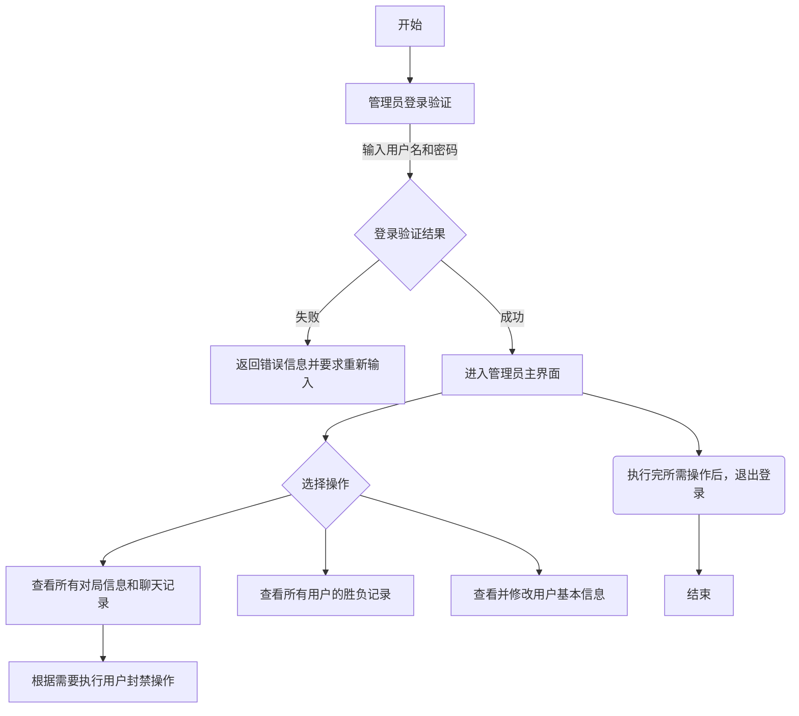

```mermaid
graph TD
    A[开始] --> B[管理员登录验证]
    B --> |输入用户名和密码| C{登录验证结果}
    C --> |失败| D[返回错误信息并要求重新输入]
    C --> |成功| E[进入管理员主界面]
    E --> F{选择操作}
    F --> G[查看所有对局信息和聊天记录]
    G --> H[根据需要执行用户封禁操作]
    F --> I[查看所有用户的胜负记录]
    F --> J[查看并修改用户基本信息]
    E --> K(执行完所需操作后，退出登录)
    K --> L[结束]
```