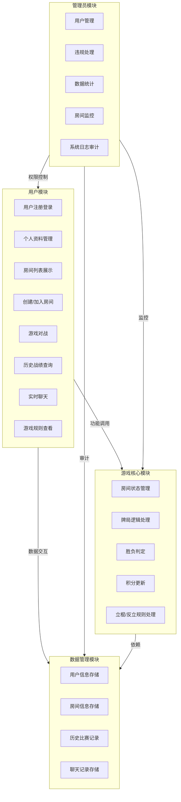

```mermaid
graph TD
    subgraph 用户模块
        U1[用户注册登录]
        U2[个人资料管理]
        U3[房间列表展示]
        U4[创建/加入房间]
        U5[游戏对战]
        U6[历史战绩查询]
        U7[实时聊天]
        U8[游戏规则查看]
    end

    subgraph 管理员模块
        A1[用户管理]
        A2[违规处理]
        A3[数据统计]
        A4[房间监控]
        A5[系统日志审计]
    end

    subgraph 游戏核心模块
        G1[房间状态管理]
        G2[牌局逻辑处理]
        G3[胜负判定]
        G4[积分更新]
        G5[立棍/反立规则处理]
    end

    subgraph 数据管理模块
        D1[用户信息存储]
        D2[房间信息存储]
        D3[历史比赛记录]
        D4[聊天记录存储]
    end

    用户模块 -->|功能调用| 游戏核心模块
    用户模块 -->|数据交互| 数据管理模块
    管理员模块 -->|权限控制| 用户模块
    管理员模块 -->|监控| 游戏核心模块
    管理员模块 -->|审计| 数据管理模块
    游戏核心模块 -->|依赖| 数据管理模块
```